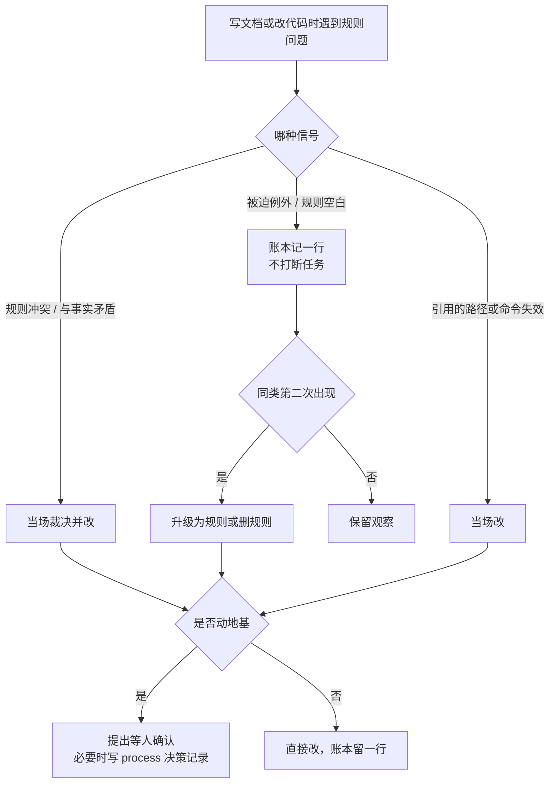
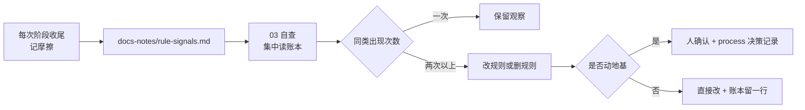

# 参考：规则演化闭环

规则不靠一次定全，靠摩擦报信、自查结算。文字说明见 `reference/rule-evolution.md`，这里只放图。

## 一次摩擦怎么走

```mermaid
flowchart TD
    A["写文档或改代码时遇到规则问题"] --> B{"哪种信号"}
    B -->|"规则冲突 / 与事实矛盾"| C["当场裁决并改"]
    B -->|"被迫例外 / 规则空白"| D["账本记一行<br/>不打断任务"]
    B -->|"引用的路径或命令失效"| E["当场改"]
    D --> F{"同类第二次出现"}
    F -->|否| G["保留观察"]
    F -->|是| H["升级为规则或删规则"]
    C --> I{"是否动地基"}
    H --> I
    E --> I
    I -->|是| J["提出等人确认<br/>必要时写 process 决策记录"]
    I -->|否| K["直接改，账本留一行"]
```

## 结算发生在哪

```mermaid
flowchart LR
    A["每次阶段收尾<br/>记摩擦"] --> B["docs-notes/rule-signals.md"]
    B --> C["03 自查<br/>集中读账本"]
    C --> D{"同类出现次数"}
    D -->|一次| E["保留观察"]
    D -->|两次以上| F["改规则或删规则"]
    F --> G{"是否动地基"}
    G -->|是| H["人确认 + process 决策记录"]
    G -->|否| I["直接改 + 账本留一行"]
```

关键点：摩擦发生时只记录，决策统一在自查时做。日常写文档不被规则维护打断，规则也不会因为没人想起而僵死。